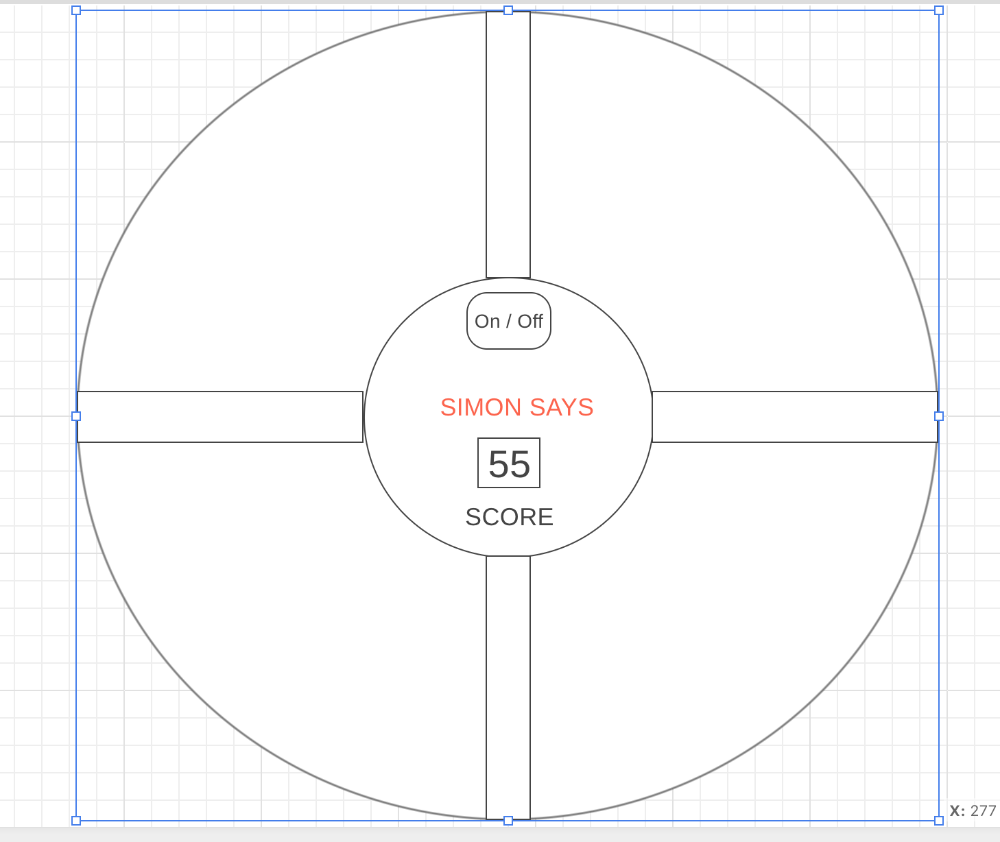

<h1>SIMON SAYS<h1>

This is a recreation of a child memory game, where the computer plays a sequence of light patters that the user must mimic in order to proceed to the next round and win the game. This recreation is a web based form of that same memory game throught the usage of HTML, CSS and Javascript.

<h4>Directions<h4>

The game will begin when the user clicks on the start button, and the sequence will start. The user will alow the light sequence to play first, then when sequene stops the user should click on the circles with pointer in the order they were lit up. After the correct sequence is played back the round counter will increase by one and the next sequene of lights will being to play.Should the incorrect sequence occur the game will buzz and display game over.

<h4>Development<h4>

<h6>Wireframe<h6>

In the beggining the desired look was an exact replica of the tangible game, will all real life functionality to create a more varient experience for the user
